# I18n Support Plus

> **v1.0.0** — Actively maintained fork of [nyavro/i18nPlugin](https://github.com/nyavro/i18nPlugin) · [Changelog](CHANGELOG.md)

Plugin ID: `com.ibrahimdans.i18n`

<!-- Plugin description -->
IntelliJ IDEA plugin providing i18n support for JavaScript, TypeScript, JSX, TSX, and PHP projects.

Supports **i18next**, **vue-i18n**, and **lingui** frameworks with JSON, YAML, and PO/POT translation files.

Highlights unresolved i18n keys, offers navigation from keys to their translation files, provides autocomplete for key names,
displays translation values as inline hints, and supports key extraction from plain text strings.
<!-- Plugin description end -->

## Supported Frameworks

| Framework | Translation functions | Config-based |
|-----------|----------------------|:------------:|
| i18next / react-i18next | `t()`, `useTranslation()` | Yes |
| vue-i18n | `$t()`, `$tc()`, `$te()` | No |
| lingui (`@lingui/core`, `@lingui/react`, `@lingui/macro`) | `msg()`, `i18n._()` | No |

`useTranslation` supports both string form (`useTranslation('ns')`) and array form (`useTranslation(['ns1', 'ns2'])`).

## Supported Languages

| Language | Extensions | Annotations | Completion | Folding | Hints | References |
|----------|-----------|:-----------:|:----------:|:-------:|:-----:|:----------:|
| JavaScript | `.js` | ✓ | ✓ | ✓ | ✓ | ✓ |
| TypeScript | `.ts` | ✓ | ✓ | ✓ | ✓ | ✓ |
| JSX | `.jsx` | ✓ | ✓ | ✓ | ✓ | ✓ |
| TSX | `.tsx` | ✓ | ✓ | ✓ | ✓ | ✓ |
| Vue SFC | `.vue` | ✓ | ✓ | ✓ | ✓ | ✓ |
| PHP | `.php` | ✓ | ✓ | ✓ | ✓ | ✓ |

> Vue support requires the Vue.js plugin (optional dependency).
> PHP support requires the PHP plugin (optional dependency).

## Translation File Formats

| Format | Extensions | References | Content generation |
|--------|-----------|:----------:|:------------------:|
| JSON | `.json`, `.json5` | ✓ | ✓ |
| YAML | `.yaml`, `.yml` | ✓ | ✓ |
| PO/POT (gettext) | `.po`, `.pot` | ✓ | ✓ |
| TypeScript (i18next config) | `.ts` | ✓ | — |

## Features

### Setup Wizard

On first launch, a wizard guides you through configuration in 3 steps:

1. **Framework detection** — auto-detects i18next, vue-i18n, or lingui in your project
2. **Translation file discovery** — scans for `.json`, `.yaml`, `.po`, and `.pot` files in `locales/`, `i18n/`, `translations/` folders
3. **Summary** — review and apply the configuration

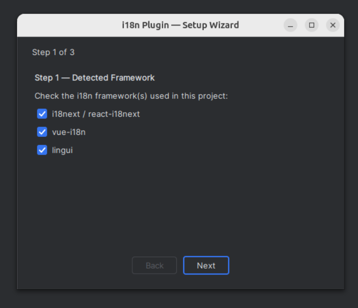
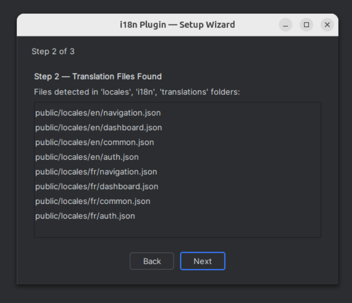
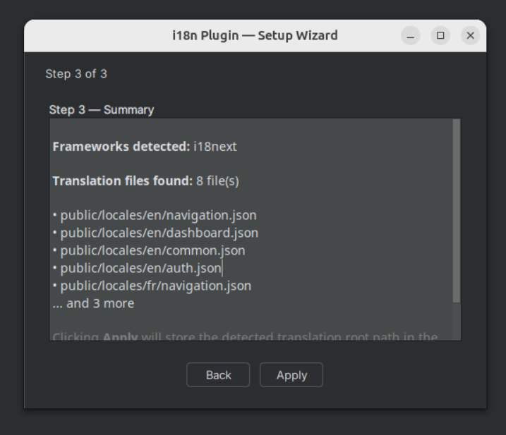

### Annotations

Highlights i18n keys with visual feedback on resolution status:

| Status | Description |
|--------|-------------|
| Resolved key | Key found in all translation files |
| Unresolved segment | Part of the key path doesn't exist |
| Missing file | Referenced namespace file not found |
| Object reference | Key points to a JSON object instead of a value |
| Plural reference | Key resolves to plural variants (`_one`, `_other`, etc.) |
| Partial translation | Key exists in some locales but not all (opt-in) |

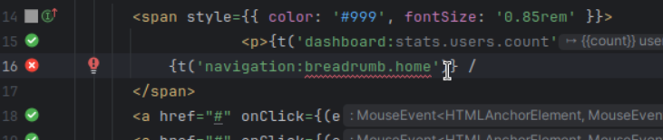
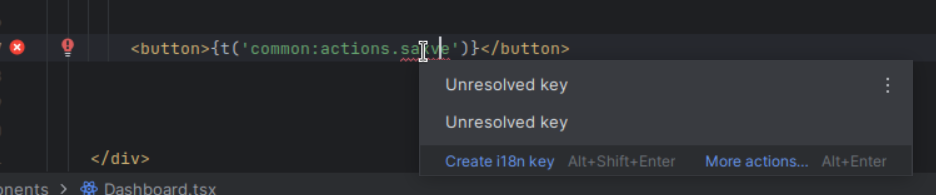
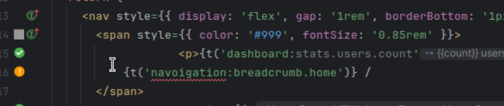

### Navigation

**Ctrl+Click** on any i18n key navigates directly to the translation value in the JSON/YAML file.

- Works with partially resolved keys (navigates to the deepest resolved node)
- Bidirectional: navigate from translation files back to code usage

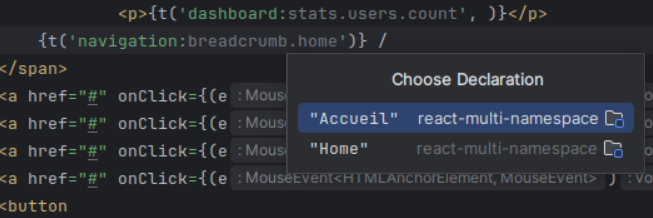

### Code Completion

Autocomplete i18n keys as you type, with full namespace support. Suggestions are drawn from all translation files in the project.

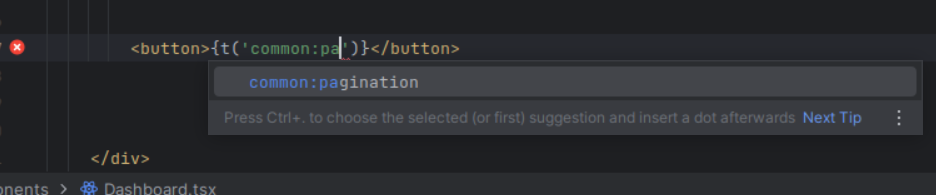

### Key Extraction

Extract hardcoded strings into translation files via **Alt+Enter** intention action. Supports sorted insertion (`Extract sorted` setting).

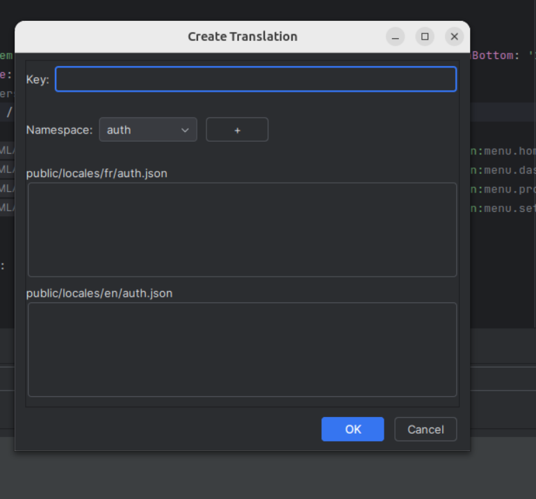
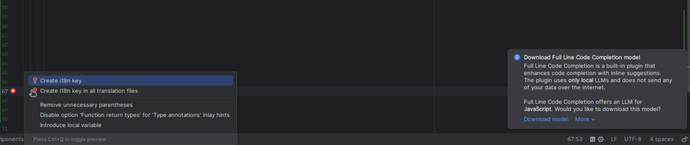
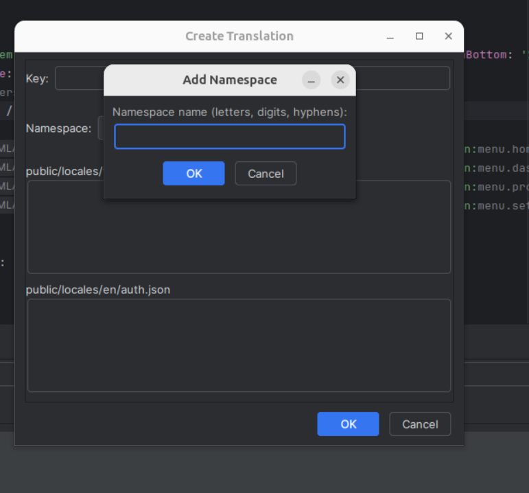
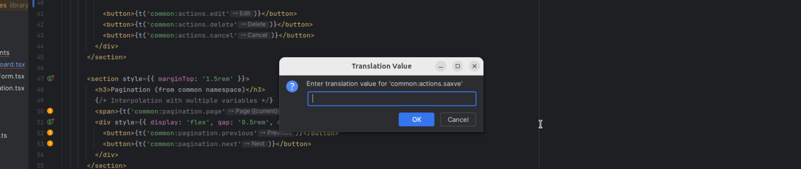

### Gutter Badges

Line markers in the editor gutter indicate key resolution status at a glance:

| Icon | Meaning |
|------|---------|
| ✅ Green | Key resolved in **all** locales |
| ⚠️ Yellow | Key resolved in **some** locales (partial) |
| ❌ Red | Key not found in **any** locale |

Clicking a partial/missing badge triggers the quick fix to create the missing key.

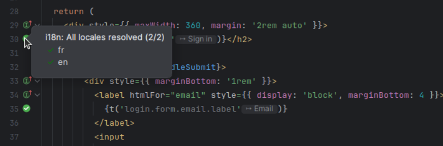

### Inlay Hints

Displays the resolved translation value inline after each i18n key expression, directly in the editor. Toggle via **Editor > Inlay Hints > i18n translations**.

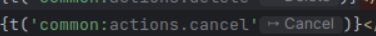

### Hover Hints

**Ctrl+hover** on an i18n key shows a tooltip with all translations grouped by locale, with missing translations shown as "—" and a navigation link (↗) to the translation file.

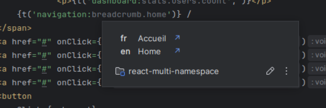

### Code Folding

Replaces i18n keys with their translation values inline for better readability. Toggle with **Ctrl+Alt+Shift+T** or via the editor context menu.

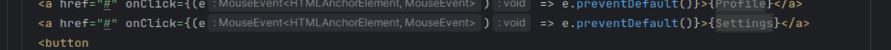
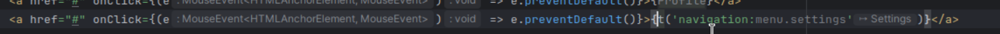

### Rename Refactoring

Rename i18n keys across all translation files and source code references with **Shift+F6**.

### Wildcard Traversal

Intermediate `*` wildcards in composite key resolution allow matching any segment at a given position. For example, `a.*.b` matches `a.foo.b`, `a.bar.b`, etc. Useful with dynamic keys where the middle segment varies.

### Quick Fixes

| Quick Fix | Trigger |
|-----------|---------|
| Create missing key | Unresolved key annotation |
| Create translation file | Missing namespace file annotation |
| Create namespace on the fly | `+` button in Create Translation dialog |

## Tool Window

The **I18n** tool window (bottom panel) provides a centralized view of all translations in the project.

### Tree View

Hierarchical view of translation keys with color-coded nodes:
- **Red** — missing keys (not present in all locales)
- **Orange** — empty values
- Double-click to edit a translation value

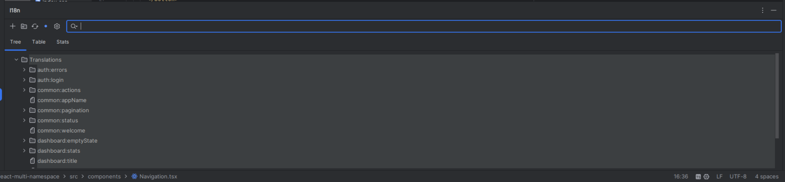

### Table View

Flat table with columns: **Key**, one column per locale, and **Usage** count. Features:
- Namespace filtering via dropdown
- **Scan Orphans** — identifies unused translation keys (usage count = 0)
- Right-click on orphan keys to delete them

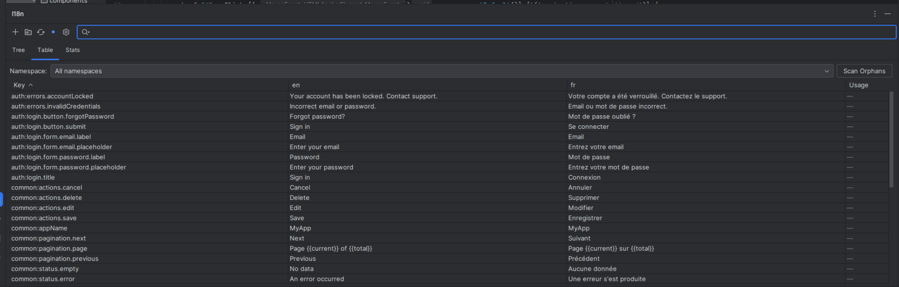
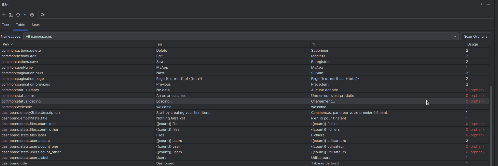

### Keys Synchronizer

Propagates missing keys across all locales in one click. When a key exists in `en.json` but not `fr.json`, the synchronizer creates the missing entry. A **batch placeholder dialog** lets you fill in values for all missing keys at once.

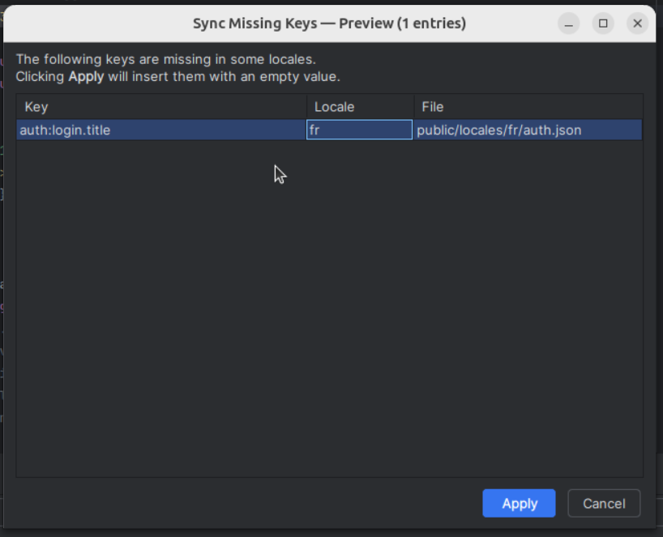

### Stats Panel

Translation coverage statistics per locale: total keys, translated count, missing count, and completion percentage.

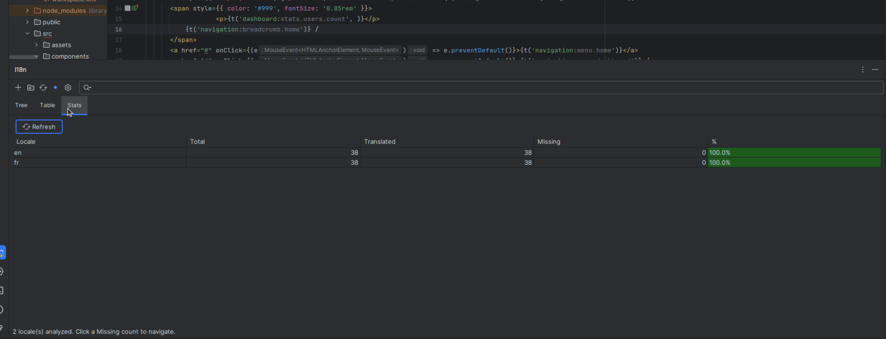

### Multi-Module Support

When 2+ modules are configured, the tool window displays a tab layer with one tab per module, each with its own Tree/Table/Stats panels.

## Configuration

**File > Tools > i18n Support Plus Configuration**

### General

| Setting | Default | Description |
|---------|---------|-------------|
| Search in project only | `true` | Limit translation file search to the project |
| Namespace separator | `:` | Separates namespace from key (e.g. `common:key`) |
| Key separator | `.` | Separates nested keys (e.g. `parent.child`) |
| Plural separator | `-` | Separates plural forms |
| Default namespace | `translation` | Default namespace(s), separated by `;`, `,` or whitespace |
| First component as namespace | `false` | Treat first key component as namespace (for Vue) |
| JS configuration file | *(empty)* | Path to i18next config file for namespace discovery |
| Translations root | *(empty)* | Custom root directory for translation files |
| Show gutter icons | `true` | Display resolution badges in the editor gutter |

### Folding

| Setting | Default | Description |
|---------|---------|-------------|
| Folding enabled | `false` | Show translation values inline in the editor |
| Preferred language | `en` | Language used for inline folding display |
| Max length | `20` | Max characters shown in folded translation |

### Inspection

| Setting | Default | Description |
|---------|---------|-------------|
| Partial translation inspection | `false` | Warn when a key exists in some locales but not others |

### Gettext

| Setting | Default | Description |
|---------|---------|-------------|
| Gettext enabled | `false` | Enable gettext/PO file support |
| Gettext aliases | `gettext,_,__` | Function names recognized as gettext calls |

### Extraction

| Setting | Default | Description |
|---------|---------|-------------|
| Extract sorted | `false` | Insert extracted keys in alphabetical order |

## Requirements

- IntelliJ IDEA 2024.3+ (build 243–263.*)
- Java 21+

### Plugin Dependencies

| Plugin | Required | Enables |
|--------|:--------:|---------|
| JavaScript | Yes | Core JS/TS support |
| Vue.js | No | vue-i18n support (`$t`, `$tc`, `$te`) |
| YAML | No | `.yaml`/`.yml` translation files |
| PHP | No | PHP language support |
| Localization | No | PO/POT gettext files |

## Installation

### From JetBrains Marketplace

Search for **"I18n Support Plus"** in **Settings > Plugins > Marketplace**.

### From Source

```bash
git clone https://github.com/IBRAHIMDANS/i18nSupportPlus.git
cd i18nSupportPlus
./gradlew buildPlugin
# Output: build/distributions/i18nSupportPlus-*.zip
```

Then install via **Settings > Plugins > ⚙️ > Install Plugin from Disk**.

## Contributing

```bash
# Build
./gradlew build

# Run tests
./gradlew test

# Launch IDE with plugin loaded
./gradlew runIde

# Code coverage
./gradlew jacocoTestReport
```

Requires Java 21 (`JAVA_HOME=/usr/lib/jvm/java-21-openjdk-amd64`).

## Credits

Originally created by [Evgeniy Nyavro](https://github.com/nyavro/i18nPlugin).

Maintained by [Ibrahim Dansoko](https://github.com/IBRAHIMDANS). Licensed under [MIT](LICENSE).
