# I18n Support Plus

Plugin ID: `com.ibrahimdans.i18n`

<!-- Plugin description -->
IntelliJ IDEA plugin providing i18n support for JavaScript, TypeScript, JSX, TSX, and PHP projects.

Supports **i18next**, **vue-i18n**, **lingui**, **react-intl**, **ngx-translate**, **svelte-i18n**, and **i18n-js** frameworks with JSON, YAML, and PO/POT translation files.

Highlights unresolved i18n keys, offers navigation from keys to their translation files, provides autocomplete for key names,
displays translation values as inline hints, and supports key extraction from plain text strings.
<!-- Plugin description end -->

## Why this plugin?

On a real i18next/vue-i18n project, your keys and translations live in files
your editor treats as dead text — so you keep opening JSON files just to check
whether a key exists, in which namespace, and whether it's translated everywhere.

**I18n Support Plus turns i18n keys into first-class code symbols.**

- **See & navigate** — inline resolution status (gutter ✅/⚠️/❌), Ctrl+Click to the
  translation and back, value hints (inlay + folding + hover), autocomplete from your
  real keys (namespaces included), dynamic/wildcard keys supported.
- **Edit safely** — extract hardcoded strings (`Alt+Enter`), rename across all
  locales and code (`Shift+F6`), move a key to another namespace (`Ctrl+Alt+Shift+M`),
  sort keys alphabetically.
- **Stay healthy** — tool window with tree/table views grouped by namespace, coverage
  stats per namespace and locale, Keys Synchronizer (propagate missing keys in bulk),
  Scan Orphans (find unused keys), CSV export/import, and inspections for empty,
  duplicate or inconsistent values.

Works with **i18next, vue-i18n, lingui, react-intl, ngx-translate, svelte-i18n & i18n-js**
across JS/TS/JSX/TSX, Vue SFC and PHP, with JSON, YAML and PO/POT files.
A setup wizard auto-configures it on first launch.

## Supported Frameworks

| Framework | Recognised syntaxes | Config-based |
|-----------|--------------------|:------------:|
| i18next / react-i18next | `t('ns:key')`, `` t(`key.${suffix}`) ``, `t('key', { ns: 'other' })`, `useTranslation('ns')`, `<Trans i18nKey="key">` | Yes |
| vue-i18n | `$t('key')`, `$tc('key')`, `$te('key')` | No |
| lingui (`@lingui/core`, `@lingui/react`, `@lingui/macro`) | `msg('key')`, `i18n._('key')`, source-based `<Trans>Hello world!</Trans>` | No |
| react-intl (FormatJS) | `formatMessage({ id: 'key' })`, `<FormattedMessage id="key" />` | No |
| ngx-translate (Angular) | `translate.instant('key')`, `.get('key')`, `.stream('key')`, `{{ 'key' \| translate }}` <sup>1</sup> | No |
| svelte-i18n | `$_('key')`, `_('key')` <sup>2</sup> | No |
| i18n-js (React Native / Expo) | `t('key')`, `i18n.t('key')`, plain locale-keyed TS/JS catalogues, nested plurals <sup>3</sup> | No |

`useTranslation` supports both string form (`useTranslation('ns')`) and array form (`useTranslation(['ns1', 'ns2'])`). The namespace can also come from an options object (`t('key', { ns: 'auth' })`) or from the key itself (`t('auth:key')`).

<sup>1</sup> The `| translate` pipe is recognised in JSX/TSX and in standalone Angular templates (`.html`). A template is parsed as Angular only inside an Angular project — a component referencing it through `templateUrl`, with `@angular/core` resolvable; outside one the file stays plain HTML and the pipe is inert text.

<sup>2</sup> `.svelte` single-file components are analysed as well, provided the [Svelte plugin](https://plugins.jetbrains.com/plugin/12375-svelte) is installed — it is not bundled with IntelliJ Ultimate, and without it a `.svelte` file is plain text to the IDE. With it, both the `<script>` block and `{…}` expressions in the markup are ordinary JavaScript, so keys inside them resolve like any other.

<sup>3</sup> i18n-js pluralizes into a nested object (`{ one: …, other: … }`) rather than through i18next's flat `key_one` suffixes; such a key is treated as resolved. Its `%{count}` placeholders are displayed verbatim, as the plugin interprets no interpolation syntax.

## Supported Languages

| Language | Extensions | Annotations | Completion | Folding | Hints | References |
|----------|-----------|:-----------:|:----------:|:-------:|:-----:|:----------:|
| JavaScript | `.js` | ✓ | ✓ | ✓ | ✓ | ✓ |
| TypeScript | `.ts` | ✓ | ✓ | ✓ | ✓ | ✓ |
| JSX | `.jsx` | ✓ | ✓ | ✓ | ✓ | ✓ |
| TSX | `.tsx` | ✓ | ✓ | ✓ | ✓ | ✓ |
| Vue SFC | `.vue` | ✓ | ✓ | ✓ | ✓ | ✓ |
| PHP | `.php` | ✓ | ✓ | ✓ | ✓ | ✓ |

> Vue support requires the Vue.js plugin (optional dependency).
> PHP support requires the PHP plugin (optional dependency).

## Translation File Formats

| Format | Extensions | References | Content generation |
|--------|-----------|:----------:|:------------------:|
| JSON | `.json`, `.json5` | ✓ | ✓ |
| YAML | `.yaml`, `.yml` | ✓ | ✓ |
| PO/POT (gettext) | `.po`, `.pot` | ✓ | ✓ |
| TypeScript (i18next config) | `.ts` | ✓ | — |

Keys are resolved as nested properties by default (`app.header.title` walks three levels).
Projects storing **flat ids** — one property per key, as react-intl / FormatJS usually do —
should enable **Treat keys as flat** in *Settings → Tools → i18n Support Plus Configuration*.
The setting turns off key-separator splitting and namespace parsing altogether, so the whole
id is looked up as a single property and translation files are located through the default
namespace.

## Features

### Setup Wizard

On first launch, a wizard guides you through configuration in 3 steps:

1. **Framework detection** — auto-detects i18next, vue-i18n, lingui, react-intl, ngx-translate, svelte-i18n or i18n-js from your `package.json`
2. **Translation file discovery** — scans for `.json`, `.yaml`, `.po`, and `.pot` files in `locales/`, `i18n/`, `translations/` folders (PO/POT support requires the optional **GNU GetText** plugin — see Plugin Dependencies)
3. **Summary** — review and apply the configuration

You can reopen it at any time from **Tools > i18n Support Plus > Run Setup Wizard**.

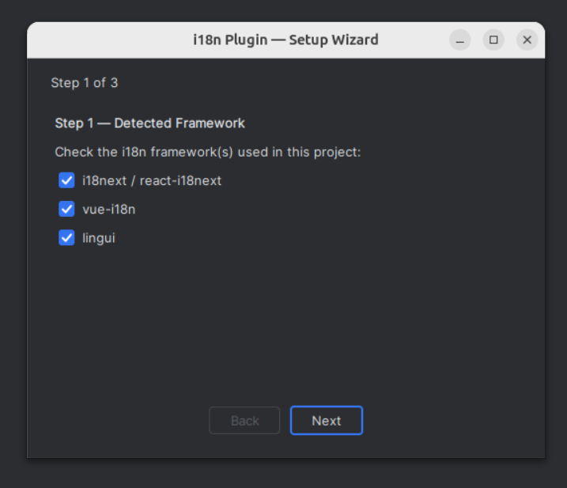
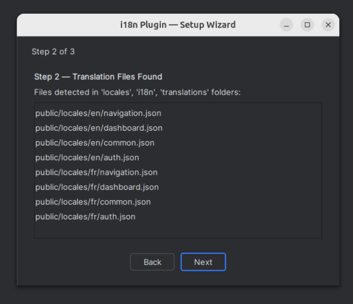
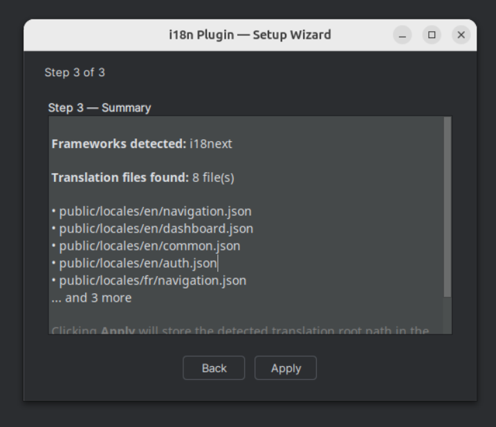

### Annotations

Highlights i18n keys with visual feedback on resolution status:

| Status | Description |
|--------|-------------|
| Resolved key | Key found in all translation files |
| Unresolved segment | Part of the key path doesn't exist |
| Missing file | Referenced namespace file not found |
| Object reference | Key points to a JSON object instead of a value |
| Plural reference | Key resolves to plural variants (`_one`, `_other`, etc.) |
| Partial translation | Key exists in some locales but not all (opt-in) |

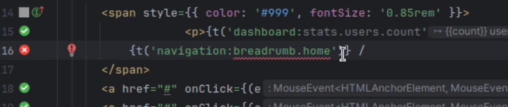
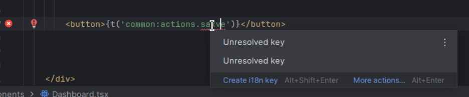
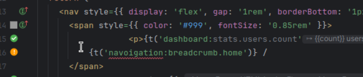

### Navigation

**Ctrl+Click** on any i18n key navigates directly to the translation value in the JSON/YAML file.

- Opens the **preview locale** (the folding language when none is set) rather than asking which file; when that locale lacks the key, every target is offered
- Works with partially resolved keys (navigates to the deepest resolved node)
- Bidirectional: navigate from translation files back to code usage

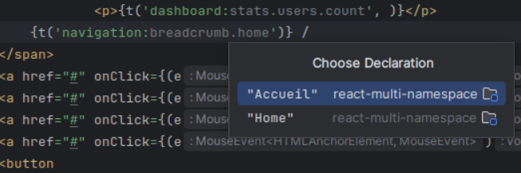

### Code Completion

Autocomplete i18n keys as you type, with full namespace support. Suggestions are drawn from all translation files in the project.

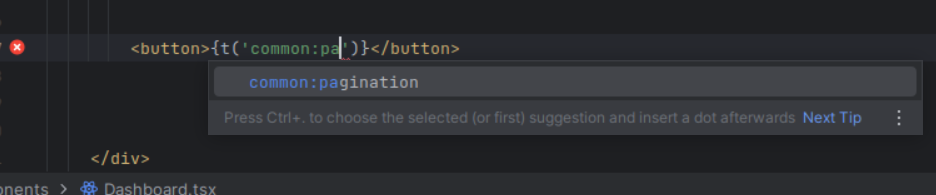

### Key Extraction

Extract hardcoded strings into translation files via **Alt+Enter** intention action. Supports sorted insertion (`Extract sorted` setting).

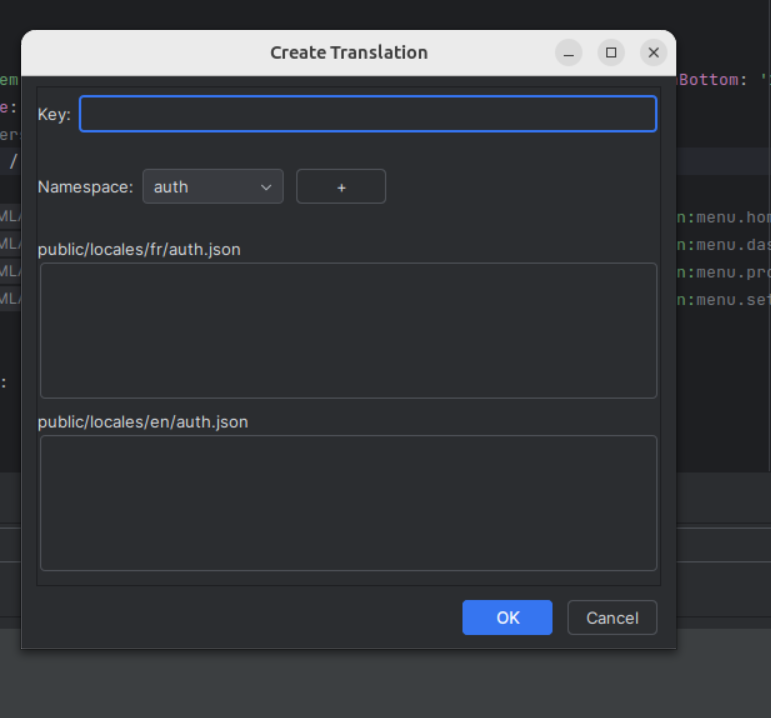
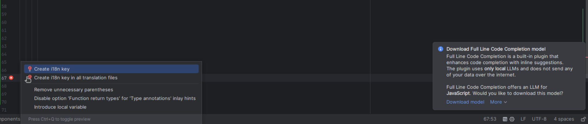
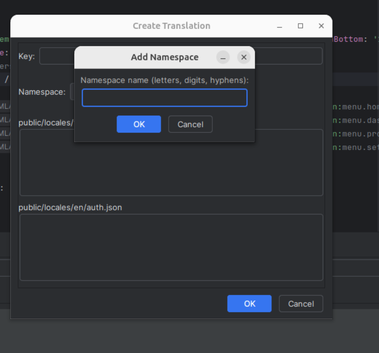
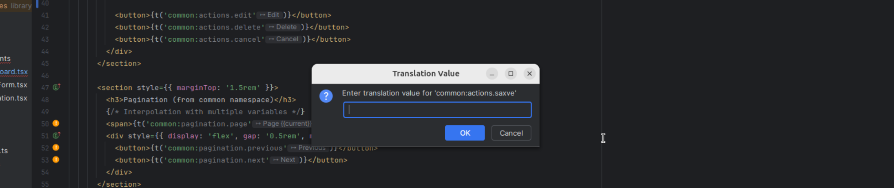

### Gutter Badges

Line markers in the editor gutter indicate key resolution status at a glance:

| Icon | Meaning |
|------|---------|
| ✅ Green | Key resolved in **all** locales |
| ⚠️ Yellow | Key resolved in **some** locales (partial) |
| ❌ Red | Key not found in **any** locale |

Hovering a badge lists the locales; clicking a partial/missing badge triggers the quick fix to create the missing key.

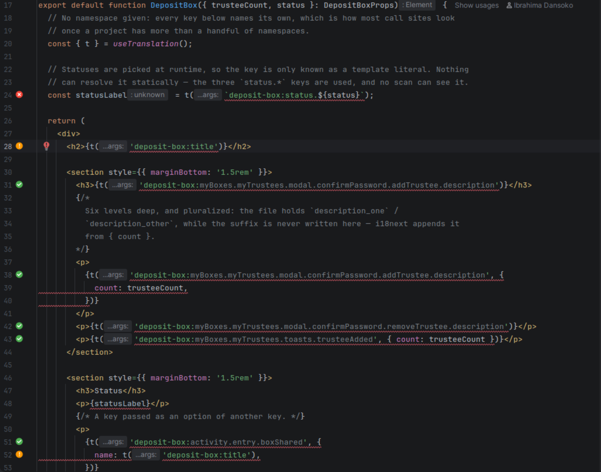
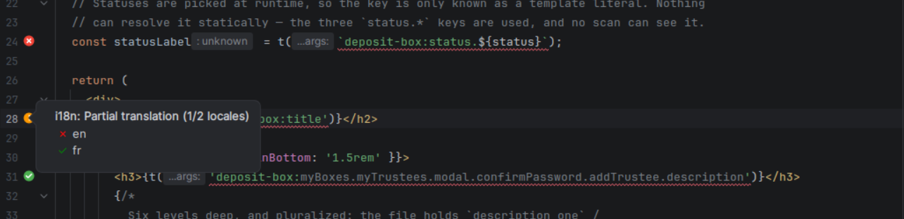

### Inlay Hints

Displays the resolved translation value inline after each i18n key expression, directly in the editor. Toggle via **Editor > Inlay Hints > i18n translations**.

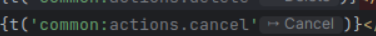

### Hover Hints

**Ctrl+hover** on an i18n key shows a tooltip with all translations grouped by locale, with missing translations shown as "—" and a navigation link (↗) to the translation file.

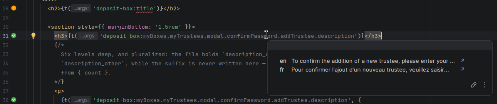

### Code Folding

Replaces i18n keys with their translation values inline for better readability. Toggle with **Ctrl+Alt+Shift+T** or via the editor context menu.

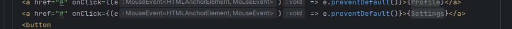
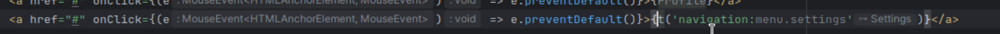

### Rename Refactoring

Rename i18n keys across all translation files and source code references with **Shift+F6** — every call site, whether written with its namespace, under a hook namespace or under a key prefix; plural suffixes (`_one`, `_other`) are kept.

### Bulk Actions

| Action | Where | What it does |
|--------|-------|--------------|
| Batch Extract i18n Keys | **Code** menu, `Ctrl+Alt+Shift+B` | Extract several hardcoded strings of a file as keys in one pass |
| Move i18n Key to Namespace… | editor context menu, `Ctrl+Alt+Shift+M` | Move a key to another namespace, updating every locale file and code reference |
| Sort i18n Keys Alphabetically | editor context menu, in a translation file | Reorder the file's keys, recursively |
| Sync Keys | **Tools > i18n Support Plus**, tool window toolbar | Create in every locale the keys it lacks, with a batch dialog to fill the values |
| Export Translations to CSV… | **Tools > i18n Support Plus** | One row per key, one column per locale |
| Import Translations from CSV… | **Tools > i18n Support Plus** | Write values back from a CSV, with a preview of what changes before anything is written |
| Cleanup Unused Keys… | **Tools > i18n Support Plus** | Scan the code for keys never used and delete the selected ones from every locale |

### Inspections

Enabled under **Settings > Editor > Inspections > i18n Support Plus**:

| Inspection | Reports |
|------------|---------|
| Empty translation value | A key whose value is blank in a translation file |
| Duplicate translation value | Two keys of a file holding the same value |
| Placeholder consistency across locales | A `{name}` or `%s` placeholder present in one locale and not in another, or an unbalanced brace |
| ICU message format validation | Unbalanced braces, a `plural` block without `one`/`other`, … |
| Unused translation key | A key of a translation file no code refers to |

### Wildcard Traversal

Intermediate `*` wildcards in composite key resolution allow matching any segment at a given position. For example, `a.*.b` matches `a.foo.b`, `a.bar.b`, etc. Useful with dynamic keys where the middle segment varies.

### Quick Fixes

| Quick Fix | Trigger |
|-----------|---------|
| Create missing key | Unresolved key annotation |
| Create translation file | Missing namespace file annotation |
| Create namespace on the fly | `+` button in Create Translation dialog |

## Tool Window

The **I18n** tool window (bottom panel) provides a centralized view of all translations in the project.

The toolbar holds the actions — add a translation, add a namespace, refresh, Sync Keys, Scan Orphans, settings —, a **search field** filtering the tree and the table by key or value (with a result count), and, when several modules are configured, a **module selector**. A project in which nothing can be read shows where the plugin looked and links to the setup wizard and the settings. The window reloads itself when a translation file changes.

**Add translation** opens the same dialog as the quick fix: the key is checked as you type, one field per locale says which file it writes to, **Copy to empty locales** fills the blanks from the reference locale, and the `+` next to the namespace creates a new one on the spot.

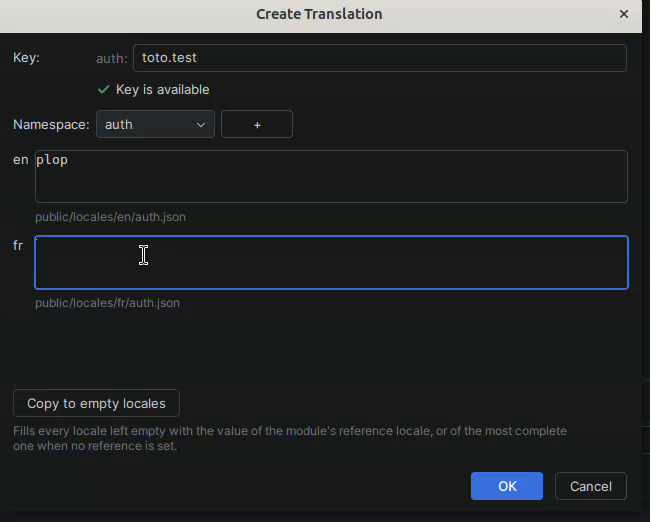
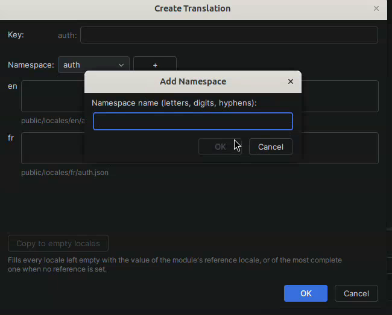

### Tree View

Keys grouped by **namespace**, then by segment. Every key carries its status three times over — an icon, per-locale badges (`EN✓ FR✗`) and a colour — so it survives a colour-blind reader or a custom theme; a branch shows how many of its keys are fully translated (`12/14 (86%)`), and a namespace row how complete the namespace is.

- **Enter** or double-click edits the key, **F4** opens the translation file at the key, typing jumps to a key
- Right-click: edit, open file, copy key
- A permanent legend sits at the bottom
- The keys of the default namespace sit in a group named after it — `common (default)` — when the configuration names a single one

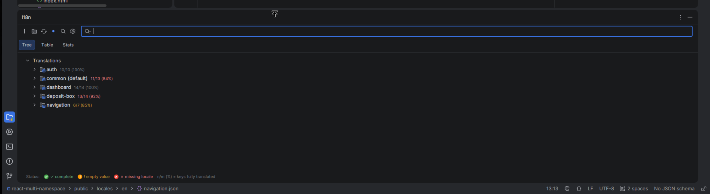
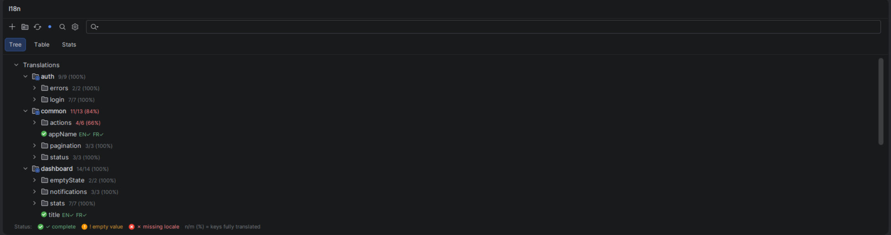

### Table View

Flat table: a **Namespace** column while the rows span several namespaces, the **Key**, one column per locale, and **Usage**. Every cell says what it is — a *Missing* or *Empty* word with an icon, the value otherwise — before being tinted.

- Locale cells are **editable in place**; the value is written straight to the file, and the entry created when the locale lacks it
- Namespace filter in the dropdown; right-click the header to hide locale columns
- **Scan Orphans** (toolbar) fills the Usage column; keys reached only through a dynamic key (`` t(`status.${kind}`) ``) are told from unused ones
- Right-click: edit, open file, delete an unused key

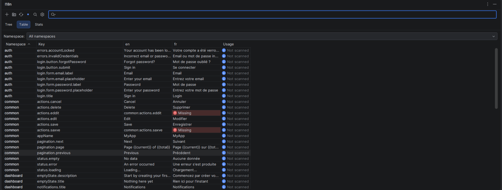
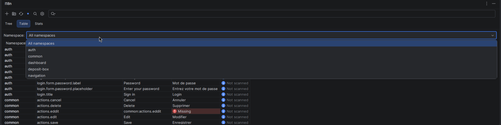
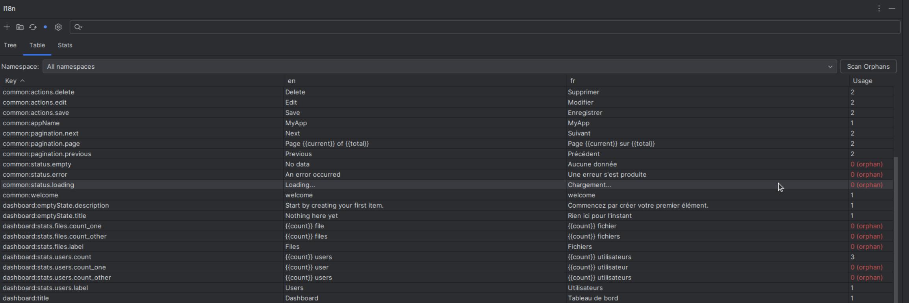

### Keys Synchronizer

Propagates missing keys across all locales in one click. When a key exists in `en.json` but not `fr.json`, the synchronizer creates the missing entry. A **batch placeholder dialog** lets you fill in values for all missing keys at once.

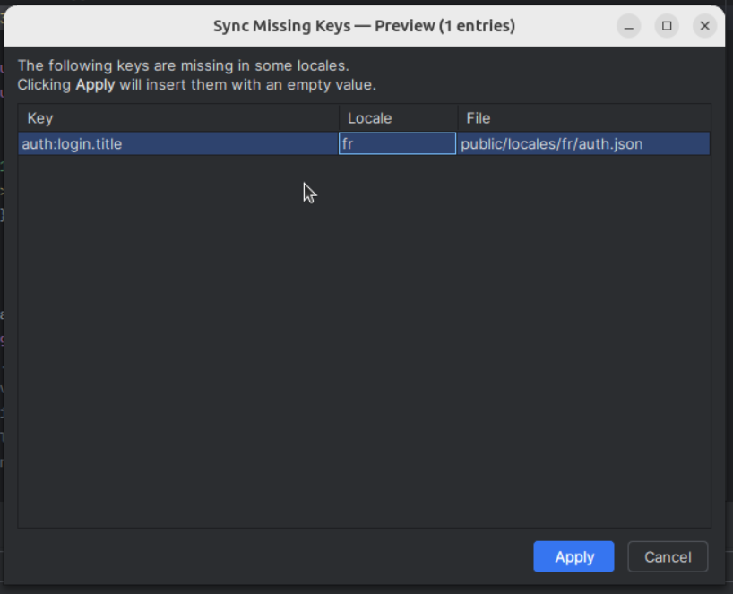

### Stats

Coverage as a matrix: one row per **namespace** under a **Total** row, one column per **locale**. A cell reads `11/13 [=====    ] 84.6%` — translated keys over the namespace's keys, a bar tinted by tier (≥ 90% complete, ≥ 50% partial, below incomplete), the percentage.

Clicking a cell lists that namespace's untranslated keys in that locale — **missing** and **empty** told apart, each next to what it says in the reference locale. **Enter** or a click opens the translation dialog on the key; **F4** opens the reference file.

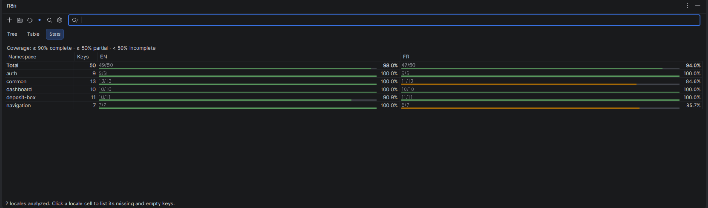
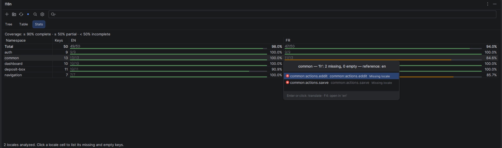

### Multi-Module Support

A monorepo is described as **modules** in the settings (root directory, path template, key template, framework preset). With two or more, the toolbar's module selector switches the three views from one module to the next; a code file inside a module's root directory resolves its keys against that module's translation files only.

## Configuration

**Settings > Tools > i18n Support Plus Configuration**

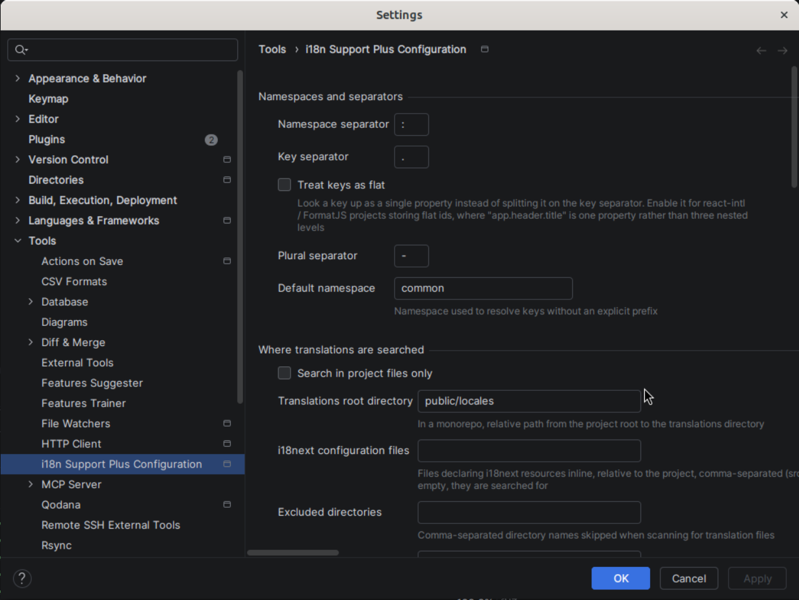

### Namespaces and separators

| Setting | Default | Description |
|---------|---------|-------------|
| Namespace separator | `:` | Separates namespace from key (e.g. `common:key`) |
| Key separator | `.` | Separates nested keys (e.g. `parent.child`) |
| Plural separator | `-` | Separates plural forms |
| Default namespace | `translation` | Namespace(s) used for keys without a prefix, separated by `;`, `,` or whitespace |
| First component as namespace | `false` | Treat the first key component as the namespace (vue-i18n) |
| Treat keys as flat | `false` | Look a key up as a single property, without splitting (react-intl / FormatJS) |

### Where translations are searched

| Setting | Default | Description |
|---------|---------|-------------|
| Search in project files only | `true` | Skip libraries and external roots |
| Translations root directory | *(empty)* | In a monorepo, path from the project root to the translations directory |
| i18next configuration files | *(empty)* | Files declaring i18next `resources` inline, comma-separated (`src/i18n.ts`) |
| Excluded directories | *(empty)* | Directory names skipped when scanning for translation files |
| Excluded file extensions | *(empty)* | Extensions on which annotations are suppressed (`php,vue`) |

### Modules

One entry per application of a monorepo: a **name**, a **root directory**, a **path template** designating its translation files (`locales/{lang}/{ns}.json`, `messages/{lang}.yml`), an optional **file template**, a **key template** saying how its code writes keys (`{ns}:{key}`, `{ns}.{key}`, `{key}`) and a framework **preset**. A diagnostics panel underneath says what each template resolves to.

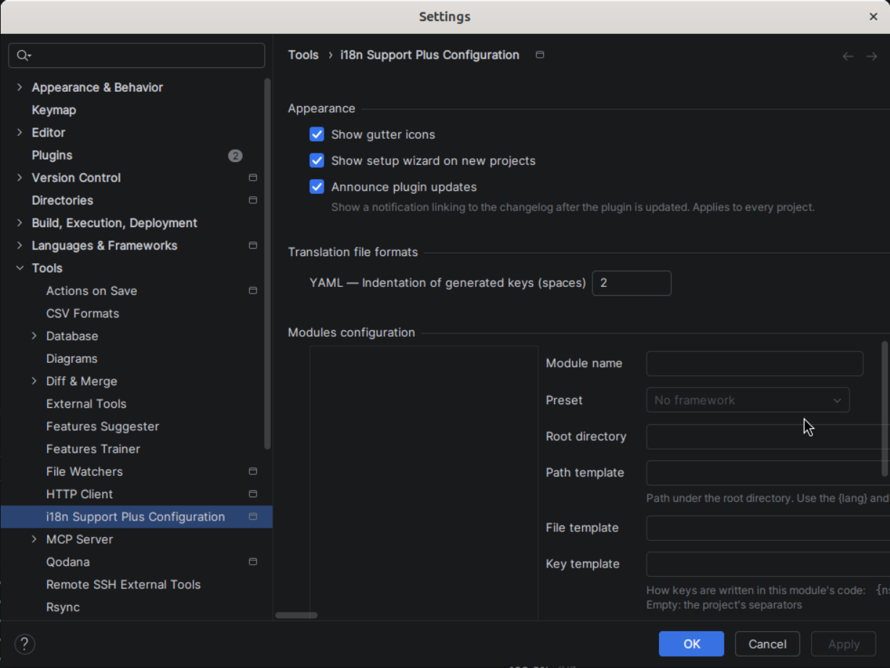

### Key assistance rules

Rules make other calls behave like `t`: a **trigger** (`translate`, `i18n.translate`, `__`) turns a function into a translation call, an **exclude** rule takes one out. Each rule can be limited to a language (`js`, `php`) and constrained on the file path, the file's imports or the key — exact, prefix or regular expression, optionally negated.

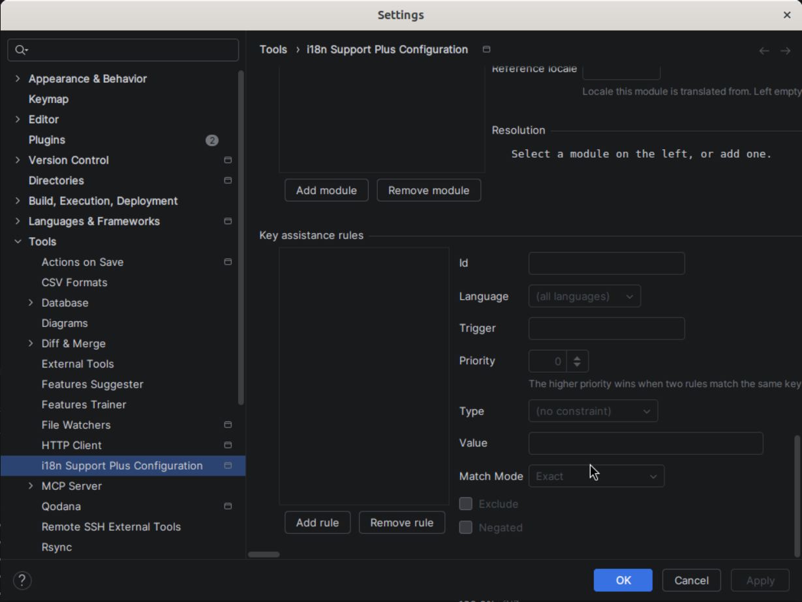

### Folding and preview

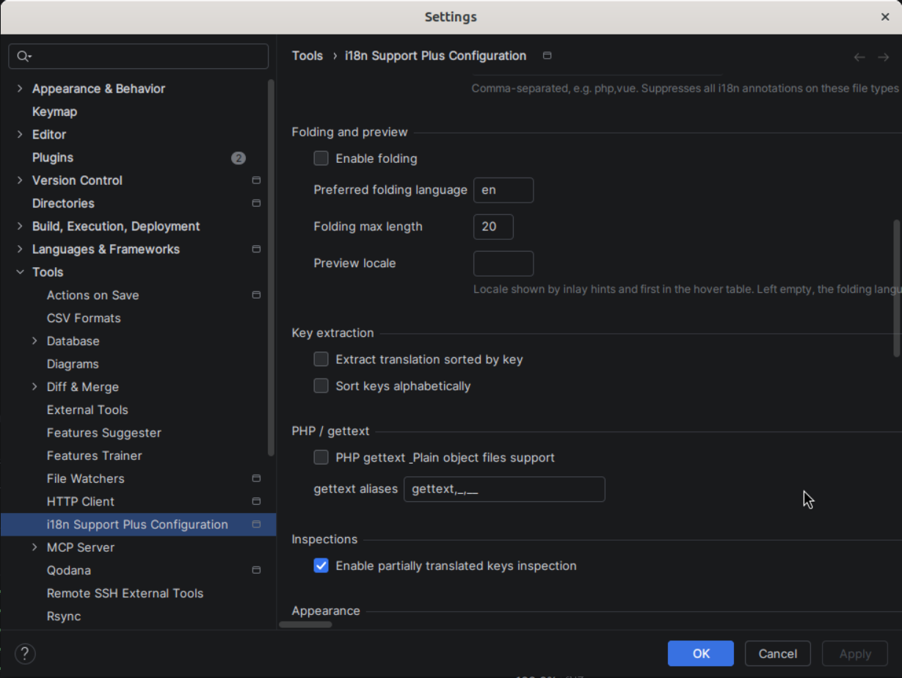

| Setting | Default | Description |
|---------|---------|-------------|
| Enable folding | `false` | Show translation values inline in place of the keys |
| Preferred folding language | `en` | Locale used by folding |
| Folding max length | `20` | Max characters shown in a folded translation |
| Preview locale | *(empty)* | Locale shown by inlay hints, first in the hover table and opened by Ctrl+click; the folding language when empty |

### Key extraction

| Setting | Default | Description |
|---------|---------|-------------|
| Extract translation sorted by key | `false` | Insert extracted keys in alphabetical order |
| Sort keys alphabetically | `false` | Keep JSON translation files sorted after every key creation |

### Inspections

| Setting | Default | Description |
|---------|---------|-------------|
| Partially translated keys inspection | `false` | Warn when a key exists in some locales but not others |

### PHP / gettext

| Setting | Default | Description |
|---------|---------|-------------|
| PHP gettext & plain object files support | `false` | Enable gettext/PO file support |
| gettext aliases | `gettext,_,__` | Function names recognized as gettext calls |

### Translation file formats

Per-format settings; the first one is the **indentation of the keys generated in YAML files** (2 spaces). JSON follows the IDE's code style.

### Appearance

| Setting | Default | Description |
|---------|---------|-------------|
| Show gutter icons | `true` | Display resolution badges in the editor gutter |
| Show setup wizard on new projects | `true` | Run the wizard the first time an unconfigured project opens |
| Announce plugin updates | `true` | After an update, a notification linking to the changelog (applies to every project) |

## Requirements

- IntelliJ IDEA 2025.1+ (build 251–263.*), verified against 2025.1, 2025.2, 2025.3, 2026.1 and 2026.2
- Java 21+

### Plugin Dependencies

| Plugin | Required | Enables |
|--------|:--------:|---------|
| JavaScript | Yes | Core JS/TS support |
| Vue.js | No | vue-i18n support (`$t`, `$tc`, `$te`) |
| YAML | No | `.yaml`/`.yml` translation files |
| PHP | No | PHP language support |
| Localization | No | PO/POT gettext files |

## Installation

### From JetBrains Marketplace

Search for **"I18n Support Plus"** in **Settings > Plugins > Marketplace**.

### From Source

```bash
git clone https://github.com/IBRAHIMDANS/i18nSupportPlus.git
cd i18nSupportPlus
./gradlew buildPlugin
# Output: "build/distributions/i18n Support Plus-<version>.zip"
```

Then install via **Settings > Plugins > ⚙️ > Install Plugin from Disk**.

## Contributing

```bash
# Build
./gradlew build

# Run tests
./gradlew test

# Launch IDE with plugin loaded
./gradlew runIde

# Code coverage
./gradlew jacocoTestReport
```

Requires Java 21 (`JAVA_HOME=/usr/lib/jvm/java-21-openjdk-amd64`).

## Credits

Originally created by [Evgeniy Nyavro](https://github.com/nyavro/i18nPlugin).

Maintained by [Ibrahim Dansoko](https://github.com/IBRAHIMDANS). Licensed under [MIT](LICENSE).
